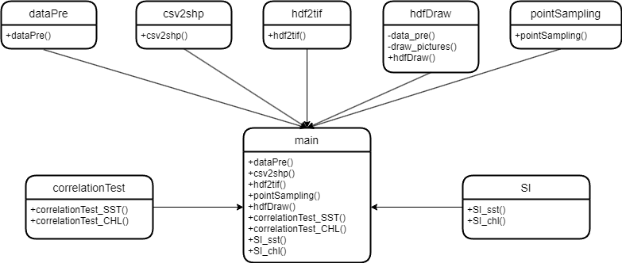
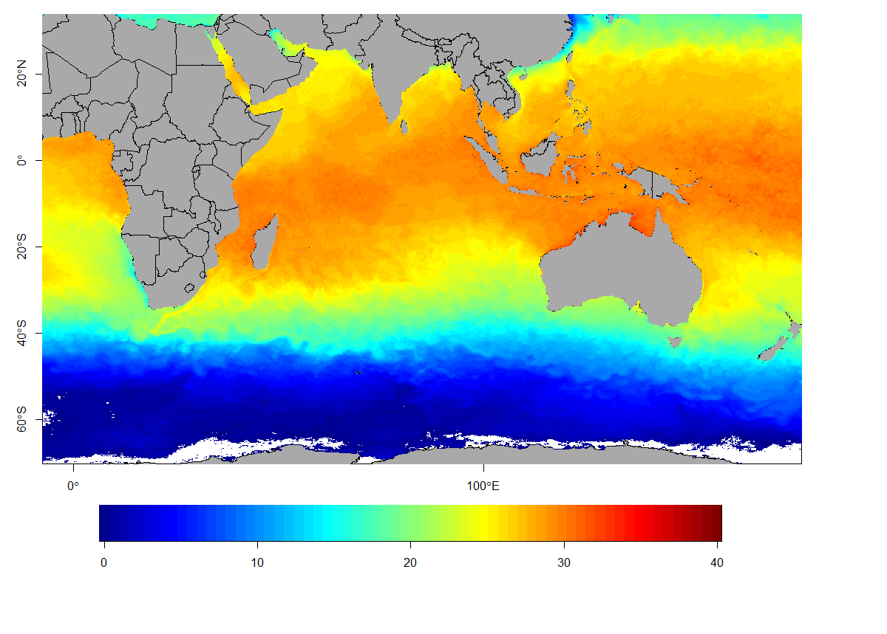

我是上海海洋大学2021级硕士生，在校学习期间选修了渔业地理信息系统、R语言在渔业中的应用和渔业案例分析与研讨这三门课，受课程内容启发编写了如下代码，本意是希望它能实现渔获分布与环境因子关系的自动计算，但是本人非渔业出身，硕士研究方向也非渔业相关方向，只能将代码推进到这种程度，欢迎选修了这三门课或者能用到这份代码的师弟师妹续写、优化它，本代码遵守MIT开源协议。

# 代码结构

# 渲染函数

